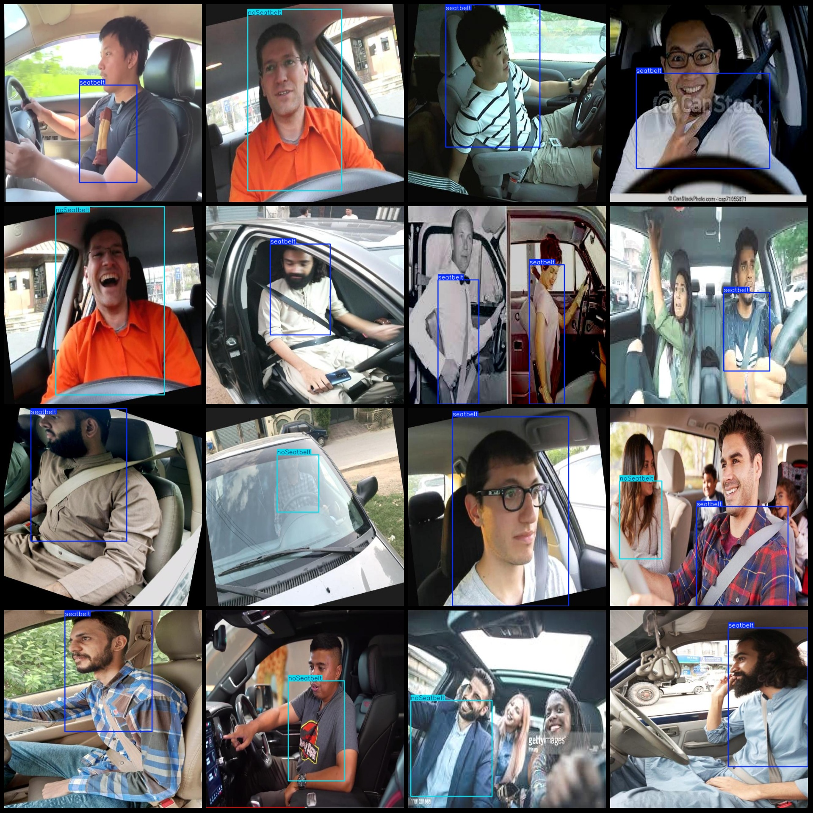
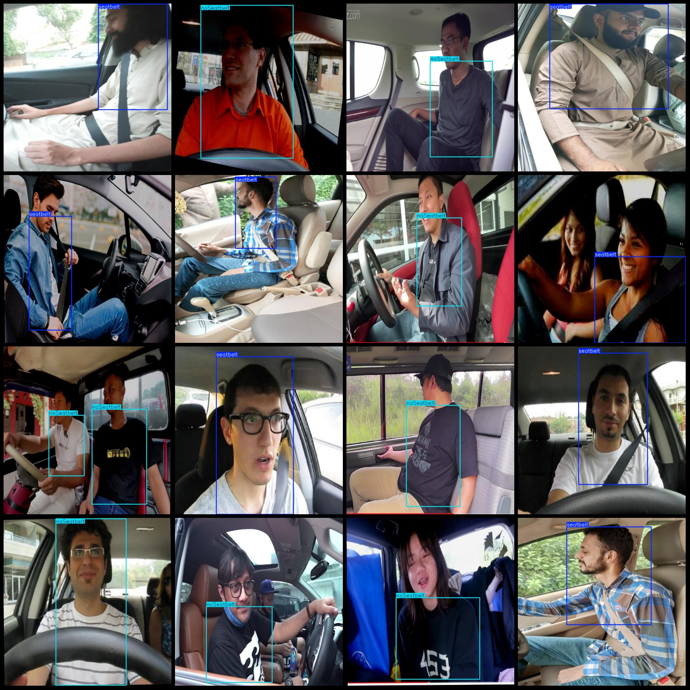

# Intelligent Traffic Drivers Seatbelt-Detection Dataset VOC+YOLO Format: 1313 Images in 2 Classes

Dataset Format: Pascal VOC format + YOLO format (txt file without split path, only containing jpg images and corresponding VOC format xml files and yolo format txt files)
Number of images (jpg file count): 1313
Number of annotations (xml file count): 1313
Number of annotations (txt file count): 1313
Number of annotation categories: 2
Annotation category names (note that the order in the yolo format does not correspond to this, but is based on the labels folder's classes.txt): ["noSeatbelt", "seatbelt"]
Each category has a number of bounding boxes:
noSeatbelt bounding box count = 552
seatbelt bounding box count = 861
Total bounding box count: 1413
Each category occupies an image count:
noSeatbelt occupies images count = 526
seatbelt occupies images count = 806
Image resolution: 640x640
Annotation tool used: labelImg
Annotation rules: Draw bounding boxes for each category
Important Notice: The dataset does not have been split into training, validation, or test sets and needs to be divided by oneself.
Special Remark: This dataset does not guarantee the accuracy of the trained model or the weight files.
Image Preview:
Example of annotation:

## Image

Here is a pay link on Stripe ( https://buy.stripe.com/3cs8yP7sY87d0vu9AB ). Please contact me lonlonago@foxmail.com after funding $89, and I will send you a complete data files , thank you!

